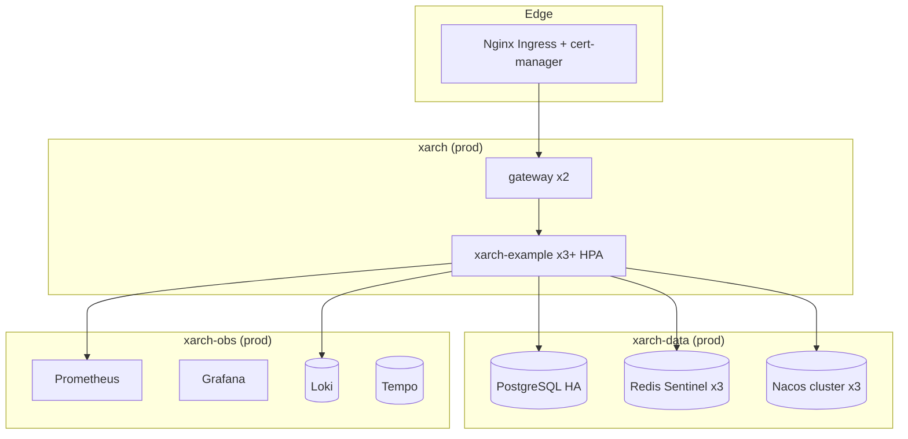

# Deployment Guide

> How to run xarch in local development, staging, and production.
> Covers Docker Compose, Kubernetes, databases, Redis, Nacos, ingress,
> TLS, observability, backup, scaling, and troubleshooting.

---

## Table of Contents

1. [Deployment Tiers](#deployment-tiers)
2. [Local Development (Docker Compose)](#local-development-docker-compose)
3. [Staging (Single-Node K8s)](#staging-single-node-k8s)
4. [Production (Multi-Node K8s)](#production-multi-node-k8s)
5. [Database Setup](#database-setup)
6. [Redis Setup](#redis-setup)
7. [Nacos Setup](#nacos-setup)
8. [Ingress & TLS](#ingress--tls)
9. [Monitoring (Prometheus + Grafana)](#monitoring-prometheus--grafana)
10. [Logging (Loki + Promtail)](#logging-loki--promtail)
11. [Backup & Disaster Recovery](#backup--disaster-recovery)
12. [Scaling Patterns](#scaling-patterns)
13. [Cost Optimization](#cost-optimization)
14. [Troubleshooting](#troubleshooting)

---

## Deployment Tiers

| Tier | Goal | Recommended Setup |
|------|------|-------------------|
| **Local** | Fast iteration, single dev | Docker Compose on the laptop |
| **Staging** | Pre-prod validation | Single-node K8s (`kustomize/overlays/dev`) |
| **Production** | HA, autoscaling, observability | Multi-node K8s (`overlays/prod`) + managed DB / Redis / Nacos |

Pick the tier that matches the **availability target** you need, not
the one that's biggest.

---

## Local Development (Docker Compose)

The repo ships with `docker-compose.yml` that boots the full stack
on a developer machine:

```bash
docker compose up -d
```

Services started:

| Service | Port | Purpose |
|---------|------|---------|
| `xarch-backend` | 8080 | Spring Boot application |
| `xarch-frontend` | 80 / 443 | Vue 3 admin (nginx) |
| `postgres` | 5432 | PostgreSQL 16 |
| `redis` | 6379 | Redis 7 |
| `nacos` | 8848 / 9848 | Registry + config |
| `minio` | 9000 / 9001 | S3-compatible storage |
| `prometheus` | 9090 | Metrics scraping |
| `grafana` | 3000 | Dashboards |
| `loki` | 3100 | Log aggregation |
| `alloy` | 12345 | Log shipping |

### Reset the database

```bash
docker compose down -v
docker compose up -d postgres
# init scripts under docs/db/ run automatically on first boot
```

### Hot reload during development

```bash
docker compose watch
```

This rebuilds and restarts containers whose mounted source files
have changed.

---

## Staging (Single-Node K8s)

Use the `dev` overlay for a single-node cluster (e.g. k3d,
minikube, kind, or a small VM):

```bash
# 1. Build images
docker build -t xarch-backend:dev backend
docker build -t xarch-frontend:dev vue3-admin

# 2. Apply
kustomize build k8s/overlays/dev | kubectl apply -f -

# 3. Verify
kubectl get pods -n xarch-dev
```

Resource sizing (single node, 4 vCPU / 8 GiB):

| Component | CPU | Memory | Replicas |
|-----------|-----|--------|----------|
| `xarch-backend` | 500m-1 | 512Mi-1Gi | 2 |
| `xarch-frontend` | 50m-100m | 64Mi-128Mi | 2 |
| `postgres` | 1-2 | 1Gi-2Gi | 1 |
| `redis` | 100m-500m | 128Mi-512Mi | 1 |
| `nacos` | 500m-1 | 512Mi-1Gi | 1 |

---

## Production (Multi-Node K8s)

### Reference Architecture



### Apply the Production Overlay

```bash
kustomize build k8s/overlays/prod | kubectl apply -f -
```

Required namespaces: `xarch`, `xarch-data`, `xarch-obs`.

### Pre-flight Checks

```bash
# Storage classes available
kubectl get sc

# Ingress controller installed
kubectl get ingressclass

# cert-manager installed
kubectl get pods -n cert-manager

# Cluster autoscaler running (optional)
kubectl get pods -n kube-system | grep autoscaler
```

---

## Database Setup

### PostgreSQL 16 (Default)

**Self-managed (K8s StatefulSet):**

The `k8s/base/postgres.yaml` manifest ships a single-instance
Postgres. For production, use a CloudNativePG or Zalando operator.

```yaml
apiVersion: postgresql.cnpg.io/v1
kind: Cluster
metadata:
  name: xarch-pg
spec:
  instances: 3
  primaryUpdateStrategy: unprefer
  storage:
    size: 100Gi
    storageClass: gp3
  resources:
    requests:
      cpu: "1"
      memory: 2Gi
  monitoring:
    enablePodMonitor: true
```

**Managed (RDS / Cloud SQL):**

```yaml
spring:
  datasource:
    url: jdbc:postgresql://xarch-pg.xxx.rds.amazonaws.com:5432/xarch
    username: ${DB_USERNAME}
    password: ${DB_PASSWORD}
    hikari:
      maximum-pool-size: 30
      minimum-idle: 5
      connection-timeout: 30000
```

### MySQL 8.0 (Alternative)

```yaml
spring:
  datasource:
    driver-class-name: com.mysql.cj.jdbc.Driver
    url: jdbc:mysql://xarch-mysql.xxx.rds.amazonaws.com:3306/xarch?useSSL=true&serverTimezone=UTC
    username: ${DB_USERNAME}
    password: ${DB_PASSWORD}
```

### Initialization Scripts

Located under `docs/db/`:

- `init-postgresql.sql` — Postgres schema, 30+ tables, seed data.
- `init-mysql.sql` — MySQL-compatible variant.

These run automatically on the first Postgres pod boot when mounted
into `/docker-entrypoint-initdb.d/`.

### Schema Migrations

For ongoing schema changes, use **Flyway** with versioned scripts
under `src/main/resources/db/migration/V<version>__<name>.sql`.

---

## Redis Setup

### Single Node (Dev / Small Staging)

```yaml
spring:
  redis:
    host: redis
    port: 6379
    password: ${REDIS_PASSWORD}
```

### Sentinel (Production HA)

```yaml
spring:
  redis:
    sentinel:
      master: xarch-master
      nodes: redis-sentinel-0.redis-sentinel:26379,redis-sentinel-1.redis-sentinel:26379,redis-sentinel-2.redis-sentinel:26379
    password: ${REDIS_PASSWORD}
```

### Cluster (Large Scale)

```yaml
spring:
  redis:
    cluster:
      nodes:
        - redis-cluster-0.redis:6379
        - redis-cluster-1.redis:6379
        - redis-cluster-2.redis:6379
      max-redirects: 3
    password: ${REDIS_PASSWORD}
```

---

## Nacos Setup

### Embedded (Dev)

`docker compose` starts a single-node Nacos with the default
derby storage.

### External MySQL (Recommended for Staging/Prod)

1. Create the schema from
   `nacos/distribution/conf/nacos-mysql.sql`.
2. Configure Nacos:

```properties
spring.datasource.platform=mysql
db.num=1
db.url.0=jdbc:mysql://${MYSQL_HOST}:3306/nacos?useSSL=true
db.user.0=${MYSQL_USER}
db.password.0=${MYSQL_PASSWORD}
```

3. Run a 3-node Nacos cluster (stateful set under
   `k8s/base/nacos.yaml`).

### Application Registration

```yaml
spring:
  cloud:
    nacos:
      discovery:
        server-addr: nacos:8848
        namespace: xarch-prod
        group: DEFAULT_GROUP
      config:
        server-addr: nacos:8848
        file-extension: yaml
        namespace: xarch-prod
```

---

## Ingress & TLS

### Nginx Ingress

```yaml
apiVersion: networking.k8s.io/v1
kind: Ingress
metadata:
  name: xarch
  annotations:
    nginx.ingress.kubernetes.io/proxy-body-size: 50m
    nginx.ingress.kubernetes.io/proxy-read-timeout: 600
    nginx.ingress.kubernetes.io/configuration-snippet: |
      proxy_set_header X-Forwarded-Proto $scheme;
spec:
  ingressClassName: nginx
  tls:
    - hosts: [app.xarch.example]
      secretName: xarch-tls
  rules:
    - host: app.xarch.example
      http:
        paths:
          - path: /api
            pathType: Prefix
            backend: { service: { name: xarch-backend, port: { number: 8080 } } }
          - path: /mcp
            pathType: Prefix
            backend: { service: { name: xarch-backend, port: { number: 8080 } } }
          - path: /
            pathType: Prefix
            backend: { service: { name: xarch-frontend, port: { number: 80 } } }
```

### Traefik (Alternative)

```yaml
apiVersion: traefik.ingressroute.traefik.io/v1alpha1
kind: IngressRoute
metadata:
  name: xarch
spec:
  entryPoints: [websecure]
  routes:
    - match: Host(`app.xarch.example`) && PathPrefix(`/api`)
      kind: Rule
      services: [{ name: xarch-backend, port: 8080 }]
    - match: Host(`app.xarch.example`)
      kind: Rule
      services: [{ name: xarch-frontend, port: 80 }]
  tls: { certResolver: letsencrypt }
```

### TLS via cert-manager

```yaml
apiVersion: cert-manager.io/v1
kind: Certificate
metadata:
  name: xarch-tls
spec:
  secretName: xarch-tls
  issuerRef:
    name: letsencrypt-prod
    kind: ClusterIssuer
  dnsNames: [app.xarch.example]
  duration: 2160h
  renewBefore: 720h
```

---

## Monitoring (Prometheus + Grafana)

The `logging/` directory ships a Grafana dashboard pack and a
Prometheus scrape config.

### Pod-level metrics

Enabled by Spring Boot Actuator:

```yaml
management:
  endpoints:
    web:
      exposure:
        include: health,info,metrics,prometheus
  endpoint:
    health:
      show-details: always
```

### Grafana Data Sources

- Prometheus — `http://prometheus.observability:9090`
- Loki — `http://loki.observability:3100`
- Tempo — `http://tempo.observability:3200`

### Pre-built Dashboards

| Dashboard | Purpose |
|-----------|---------|
| xarch — Application | JVM, HTTP, DB pool |
| xarch — Redis | Hit rate, memory, ops/sec |
| xarch — Nacos | Subscriptions, config pushes |
| xarch — Logs (Loki) | Live log tail |
| xarch — Traces (Tempo) | End-to-end latency |

---

## Logging (Loki + Promtail)

### Stack Layout


### Promtail Configuration (excerpt)

```yaml
server:
  http_listen_port: 9080
positions:
  filename: /tmp/positions.yaml
clients:
  - url: http://loki.observability.svc:3100/loki/api/v1/push
scrape_configs:
  - job_name: kubernetes-pods
    kubernetes_sd_configs:
      - role: pod
    relabel_configs:
      - source_labels: [__meta_kubernetes_pod_label_app]
        target_label: app
      - source_labels: [__meta_kubernetes_namespace]
        target_label: namespace
```

### LogQL Examples

```logql
{app="xarch-backend"} |= "ERROR" | json | line_format "{{.message}}"
{app="xarch-backend"} |~ "user_id=\\d+" | unwrap duration_ms
```

---

## Backup & Disaster Recovery

### PostgreSQL

**Continuous archiving (PITR):**

```bash
# Enable WAL archiving
archive_mode = on
archive_command = 'aws s3 cp %p s3://xarch-backups/wal/%f'
```

**Daily logical backup:**

```bash
pg_dump -Fc -d xarch -f xarch-$(date +%F).dump
aws s3 cp xarch-$(date +%F).dump s3://xarch-backups/db/
```

**Restore:**

```bash
pg_restore -d xarch -j 4 xarch-2026-06-24.dump
```

### Redis

- **RDB** snapshots every 15 minutes if at least 1 key changed.
- **AOF** append-only log enabled for synchronous durability.
- Snapshots shipped to S3 via the `rdb-s3-exporter`.

### Nacos

- Nacos 2-mode config can be backed up via the admin API or by
  dumping the `config-info` table.
- Schedule a daily `mysqldump` of the Nacos schema in addition to
  the application schema.

### RPO / RTO Targets

| Tier | RPO | RTO |
|------|-----|-----|
| Dev | 24 h | 4 h |
| Staging | 1 h | 1 h |
| Prod | 5 min | 30 min |

---

## Scaling Patterns

### Horizontal Pod Autoscaler

```yaml
apiVersion: autoscaling/v2
kind: HorizontalPodAutoscaler
metadata:
  name: xarch-backend
spec:
  scaleTargetRef:
    apiVersion: apps/v1
    kind: Deployment
    name: xarch-backend
  minReplicas: 3
  maxReplicas: 20
  metrics:
    - type: Resource
      resource:
        name: cpu
        target:
          type: Utilization
          averageUtilization: 70
    - type: Resource
      resource:
        name: memory
        target:
          type: Utilization
          averageUtilization: 80
  behavior:
    scaleDown:
      stabilizationWindowSeconds: 60
    scaleUp:
      stabilizationWindowSeconds: 0
```

### Cluster Autoscaler

For managed Kubernetes (EKS/GKE/AKS), enable the cluster autoscaler
on node groups tagged `k8s.io/cluster-autoscaler/enabled=true`.

### Database Scaling

- **Read replicas**: route read-only `@Transactional(readOnly=true)`
  methods to a separate datasource via `MyBatis-Flex` dynamic
  routing.
- **Connection pool**: `HikariCP` `maximum-pool-size = (cores * 2) +
  spindles`, default 20.
- **Sharding** is **not** built into xarch — pair with
  [Apache ShardingSphere](https://shardingsphere.apache.org/) when
  needed.

---

## Cost Optimization

| Lever | Action |
|-------|--------|
| **Right-size pods** | Start with 500m/512Mi; tune with VPA recommendations after 7 days of data |
| **Spot for stateless** | Run `xarch-backend` on spot / preemptible instances |
| **Scale to zero** | Dev / staging can scale `xarch-backend` to 0 replicas off-hours |
| **Log retention** | Loki: 7d hot, 30d warm, 90d cold; aggressive pruning for dev |
| **Metrics cardinality** | Drop per-request labels on high-cardinality endpoints |
| **Frontend CDN** | Put the Vue bundle behind CloudFront / Cloudflare with cache-control |
| **Single-node Nacos** | Acceptable for < 50 services; cluster only at HA requirement |

---

## Troubleshooting

### Application won't start

```bash
kubectl logs -n xarch deploy/xarch-backend --previous | head -200
```

Common causes:

- **"datasource not found"** — wrong Nacos namespace; the
  `spring.datasource.*` values are resolved late.
- **"Connection refused: 8848"** — Nacos still starting; increase
  `initialDelaySeconds` on the readiness probe.
- **"ClassNotFoundException: com.xarch.starter..."** — a starter
  is missing from the build; rebuild with `--refresh-dependencies`.

### High p99 latency

```bash
# Check Tomcat thread pool
curl http://app.xarch.example/actuator/metrics/tomcat.threads.busy
curl http://app.xarch.example/actuator/metrics/tomcat.threads.config.max

# Slow queries
curl http://app.xarch.example/actuator/metrics/jdbc.connections.active
```

Fixes:

- **Threads exhausted** — increase `server.tomcat.threads.max`
  or scale out.
- **DB bottleneck** — check `pg_stat_activity` for long-running
  queries; add indexes.
- **Redis latency** — check `redis-cli --latency`.

### MCP server unreachable from AI client

```bash
# Verify stdio launch
bun run node-mcp-servers/database-mcp/dist/index.js
# Should print a JSON-RPC banner and wait for input
```

Common causes:

- Wrong path in `claude_desktop_config.json`.
- Environment variables not exported; check `.env` or process
  inspector.
- Bun not on PATH (use absolute path `/home/user/.bun/bin/bun`).

### Database migration failed

```bash
# Inspect Flyway state
psql -d xarch -c "SELECT version, description, success FROM flyway_schema_history ORDER BY installed_rank;"
```

Roll back to the previous version with `flyway:repair`, then
re-apply the corrected migration.

### Lost JWT secret after Nacos restart

JWT secret is stored in Nacos encrypted config under
`xarch.security.jwt.secret`. **Always back up the encryption key**
separately — losing it forces all users to re-authenticate and
invalidates refresh tokens.

---

## Related Documents

- [ARCHITECTURE.md](ARCHITECTURE.md)
- [MCP_GUIDE.md](MCP_GUIDE.md)
- [SECURITY.md](../SECURITY.md)
- [FAQ.md](FAQ.md)