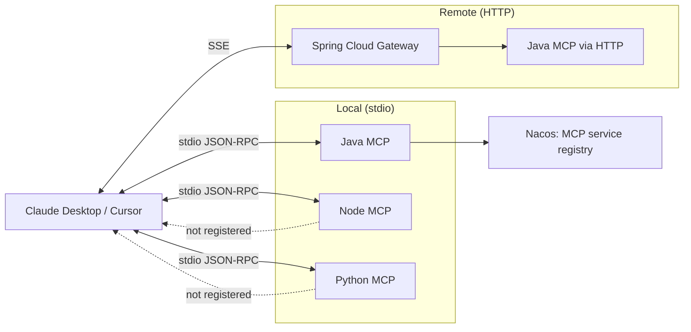

# MCP Guide

> Complete guide to the **Model Context Protocol (MCP)** servers shipped
> with xarch — architecture, configuration, tool reference, and
> integration patterns.

---

## Table of Contents

1. [What is MCP and Why Use It](#what-is-mcp-and-why-use-it)
2. [Architecture](#architecture)
3. [Server Reference](#server-reference)
4. [Configuration](#configuration)
5. [Tool Reference](#tool-reference)
6. [Client Integration](#client-integration)
7. [Adding a New MCP Server](#adding-a-new-mcp-server)
8. [Performance Tips](#performance-tips)
9. [Security Considerations](#security-considerations)

---

## What is MCP and Why Use It

The **Model Context Protocol** is an open protocol that standardizes
how LLM clients (Claude Desktop, Cursor, custom agents) discover and
call **tools** exposed by external systems. A tool is described by:

- a JSON schema for its inputs,
- a name and human-readable description,
- a server that knows how to execute it.

By exposing database, knowledge, filesystem, and vector capabilities
as MCP servers, xarch turns every backed enterprise system into a
citizen of the LLM ecosystem — no custom glue code, no per-vendor
integration.

### Why ship MCP servers with the framework?

| Reason | Detail |
|--------|--------|
| **AI-First** | xarch's positioning — the framework is the natural home for AI tool definitions. |
| **Natively multi-language** | Java, Node.js, and Python implementations share the same tool surface. |
| **Hot-swappable** | The same client can switch between stdio and HTTP transports without changing tool calls. |
| **Standardized errors** | All servers return a uniform error envelope, simplifying client error handling. |

---

## Architecture

### Transports

| Transport | Use Case | Latency |
|-----------|----------|---------|
| **stdio** | Local CLI integration (Claude Desktop) | Sub-millisecond |
| **HTTP/SSE** | Long-running clients, multi-user servers | ~5–20 ms |

### Component Diagram



### Runtime Comparison

| Runtime | Cold Start | Memory | TypeScript | Hot Reload |
|---------|------------|--------|------------|------------|
| Node.js + tsx | ~250 ms | ~80 MB | Needs `tsc` | `tsx watch` |
| **Bun** | **~30 ms** | **~50 MB** | **Built-in** | **Built-in** |
| Python 3.12 | ~80 ms | ~60 MB | n/a | `watchdog` |

Bun is recommended for production Node MCP servers when cold-start
latency matters (e.g. many short-lived servers spawned per LLM
session).

---

## Server Reference

| Server | Languages | Purpose |
|--------|-----------|---------|
| [`database-mcp`](#1-database-mcp) | Java, Node, Python | SQL query, execute, schema introspection |
| [`knowledge-mcp`](#2-knowledge-mcp) | Java, Node, Python | RAG: index, search, manage documents |
| [`filesystem-mcp`](#3-filesystem-mcp) | Java, Node, Python | Sandboxed file ops |
| [`vector-mcp`](#4-vector-mcp) | Java, Node, Python | Vector CRUD + KNN |

---

## Configuration

All servers read from environment variables (preferred) or a
`config.yaml` in the working directory. Common keys:

| Variable | Description | Example |
|----------|-------------|---------|
| `MCP_TRANSPORT` | `stdio` or `http` | `stdio` |
| `MCP_PORT` | HTTP listen port (HTTP only) | `9090` |
| `MCP_LOG_LEVEL` | `debug` / `info` / `warn` / `error` | `info` |
| `MCP_NACOS_ADDR` | Nacos server address (Java MCP only) | `127.0.0.1:8848` |
| `MCP_NACOS_NAMESPACE` | Namespace for registration | `xarch-cloud` |

### Per-server examples

**Database MCP (`database-mcp`)**

```env
DB_DRIVER=postgresql
DB_URL=jdbc:postgresql://localhost:5432/xarch
DB_USERNAME=xarch
DB_PASSWORD=********
DB_POOL_MAX=20
DB_QUERY_TIMEOUT_MS=5000
```

**Knowledge MCP (`knowledge-mcp`)**

```env
KB_VECTOR_BACKEND=qdrant
KB_QDRANT_URL=http://localhost:6333
KB_EMBEDDING_MODEL=text-embedding-3-small
KB_EMBEDDING_PROVIDER=openai
KB_CHUNK_SIZE=512
KB_CHUNK_OVERLAP=64
```

**Filesystem MCP (`filesystem-mcp`)**

```env
FS_ALLOWED_ROOTS=/var/xarch/data,/srv/share
FS_ALLOWED_EXTENSIONS=.txt,.md,.pdf,.docx,.json
FS_MAX_FILE_SIZE_MB=64
FS_FOLLOW_SYMLINKS=false
```

**Vector MCP (`vector-mcp`)**

```env
VECTOR_BACKEND=qdrant
VECTOR_URL=http://localhost:6333
VECTOR_DIMENSION=1536
VECTOR_DEFAULT_TOP_K=10
```

---

## Tool Reference

The schemas below are identical across all language implementations.

### 1. database-mcp

| Tool | Parameters | Returns |
|------|------------|---------|
| `health` | — | `{ status, version }` |
| `configure` | `{ driver, url, username, password }` | `{ ok }` |
| `query_execute` | `{ sql, params?, limit? }` | `{ columns[], rows[], row_count, duration_ms }` |
| `execute_update` | `{ sql, params? }` | `{ affected_rows }` |
| `schema_get` | `{ schema? }` | `{ tables[] }` |
| `table_list` | `{ schema? }` | `{ tables[] }` |
| `table_describe` | `{ table }` | `{ columns[], indexes[], foreign_keys[] }` |

Example:

```json
{
  "tool": "query_execute",
  "args": {
    "sql": "SELECT id, username FROM sys_user WHERE dept_id = ? LIMIT ?",
    "params": [42, 50]
  }
}
```

### 2. knowledge-mcp

| Tool | Parameters | Returns |
|------|------------|---------|
| `health` | — | `{ status, documents, chunks }` |
| `kb_index_document` | `{ source, content, metadata? }` | `{ document_id, chunks }` |
| `kb_get_document` | `{ document_id }` | `{ id, content, metadata }` |
| `kb_search` | `{ query, top_k?, filter? }` | `{ results[{ document_id, score, snippet }] }` |
| `kb_delete` | `{ document_id }` | `{ ok }` |
| `kb_list` | `{ prefix?, limit? }` | `{ documents[] }` |
| `kb_stats` | — | `{ documents, chunks, vectors, last_indexed_at }` |

Example:

```json
{
  "tool": "kb_search",
  "args": {
    "query": "How do I reset a user's password?",
    "top_k": 5,
    "filter": { "category": "operations" }
  }
}
```

### 3. filesystem-mcp

| Tool | Parameters | Returns |
|------|------------|---------|
| `health` | — | `{ status, allowed_roots[] }` |
| `list_directory` | `{ path, recursive?, max_depth? }` | `{ entries[] }` |
| `read_file` | `{ path, encoding?, max_bytes? }` | `{ content, size, mime }` |
| `write_file` | `{ path, content, mode? }` | `{ ok, bytes_written }` |
| `delete` | `{ path, recursive? }` | `{ ok }` |
| `create_directory` | `{ path, parents? }` | `{ ok }` |
| `search_files` | `{ root, pattern, max_results? }` | `{ matches[] }` |
| `get_file_info` | `{ path }` | `{ size, mtime, ctime, mime }` |

### 4. vector-mcp

| Tool | Parameters | Returns |
|------|------------|---------|
| `health` | — | `{ status, backend, vector_count }` |
| `vector_create_collection` | `{ name, dimension, metric? }` | `{ ok }` |
| `vector_delete_collection` | `{ name }` | `{ ok }` |
| `vector_upsert` | `{ collection, id?, vector, payload? }` | `{ id }` |
| `vector_delete` | `{ collection, id }` | `{ ok }` |
| `vector_search` | `{ collection, vector, top_k?, filter? }` | `{ matches[{ id, score, payload }] }` |
| `vector_count` | `{ collection }` | `{ count }` |

---

## Client Integration

### Claude Desktop

Edit `~/.config/claude_desktop_config.json` (Linux/macOS) or
`%APPDATA%\Claude\claude_desktop_config.json` (Windows):

```json
{
  "mcpServers": {
    "xarch-database": {
      "command": "bun",
      "args": ["run", "node-mcp-servers/database-mcp/dist/index.js"]
    },
    "xarch-knowledge": {
      "command": "bun",
      "args": ["run", "node-mcp-servers/knowledge-mcp/dist/index.js"]
    },
    "xarch-filesystem": {
      "command": "bun",
      "args": ["run", "node-mcp-servers/filesystem-mcp/dist/index.js"]
    },
    "xarch-vector": {
      "command": "bun",
      "args": ["run", "node-mcp-servers/vector-mcp/dist/index.js"]
    }
  }
}
```

### Cursor

`Cursor > Settings > MCP > Add new global MCP server` with the
same JSON object above.

### Custom (Python)

```python
from mcp import Client

async with Client("bun", ["run", "node-mcp-servers/database-mcp/dist/index.js"]) as c:
    tools = await c.list_tools()
    result = await c.call_tool("query_execute", {
        "sql": "SELECT 1 AS hello",
    })
    print(result)
```

### Custom (TypeScript)

```typescript
import { Client } from "@modelcontextprotocol/sdk/client/index.js";
import { StdioClientTransport } from "@modelcontextprotocol/sdk/client/stdio.js";

const transport = new StdioClientTransport({
  command: "bun",
  args: ["run", "node-mcp-servers/database-mcp/dist/index.js"],
});
const client = new Client({ name: "demo", version: "0.1.0" }, { capabilities: {} });
await client.connect(transport);
const { tools } = await client.listTools();
const { content } = await client.callTool({ name: "query_execute", arguments: { sql: "SELECT 1" } });
```

---

## Adding a New MCP Server

A minimal Node.js MCP server looks like this:

```typescript
import { Server } from "@modelcontextprotocol/sdk/server/index.js";
import { StdioServerTransport } from "@modelcontextprotocol/sdk/server/stdio.js";

const server = new Server({ name: "my-tool", version: "0.1.0" }, {
  capabilities: { tools: {} },
});

server.setRequestHandler("tools/list", async () => ({
  tools: [
    {
      name: "echo",
      description: "Echoes its input.",
      inputSchema: {
        type: "object",
        properties: { text: { type: "string" } },
        required: ["text"],
      },
    },
  ],
}));

server.setRequestHandler("tools/call", async ({ params }) => {
  if (params.name === "echo") {
    return { content: [{ type: "text", text: params.arguments.text }] };
  }
  throw new Error(`Unknown tool: ${params.name}`);
});

await server.connect(new StdioServerTransport());
```

To register it as a **Nacos MCP service** (Java only), annotate the
server with `@McpServer`:

```java
@McpServer(name = "my-tool", version = "0.1.0", group = "MCP")
@Component
public class MyToolServer implements McpServer {
    @Tool(name = "echo", description = "Echoes its input")
    public String echo(@ToolArg("text") String text) {
        return text;
    }
}
```

`xarch-cloud-starter-nacos` picks the bean up at startup and
publishes it to Nacos under the `MCP` group.

---

## Performance Tips

- **Use Bun** for Node MCP servers when many short-lived instances
  are spawned (3-4× faster cold start).
- **Keep schemas small** — the tool schema is sent on every
  `tools/list` call.
- **Batch operations** where possible — `vector_upsert` accepts
  multiple items per call.
- **Cache the embedding model** in `knowledge-mcp`; avoid re-loading
  on every search.
- **Stream large reads** for `filesystem-mcp` files over 10 MB
  rather than buffering.
- **Pre-warm the connection pool** for `database-mcp` (set
  `DB_POOL_MIN > 0`).

---

## Security Considerations

- **Filesystem MCP** uses path-traversal protection — never disable
  `FS_FOLLOW_SYMLINKS`. Validate that all paths in
  `FS_ALLOWED_ROOTS` are absolute and owned by a non-root user.
- **Database MCP** uses parameterized queries exclusively. Never
  expose the `configure` tool to untrusted callers — it accepts
  arbitrary connection strings.
- **Knowledge MCP** documents may contain sensitive content. Run
  the embedding model in your VPC; do not leak chunks to a public
  embedding API.
- **Vector MCP** payloads can carry arbitrary metadata; sanitize
  before storage to avoid indexing secrets.
- **All servers** should run as a non-root user with a read-only
  filesystem where possible. Provide secrets via env vars, never
  in CLI arguments.

---

## Related Documents

- [ARCHITECTURE.md](ARCHITECTURE.md) — system architecture
- [DEPLOYMENT.md](DEPLOYMENT.md) — deploying MCP servers in K8s
- [FAQ.md](FAQ.md) — common questions
- [API_REFERENCE.md](API_REFERENCE.md) — HTTP gateway endpoints for MCP