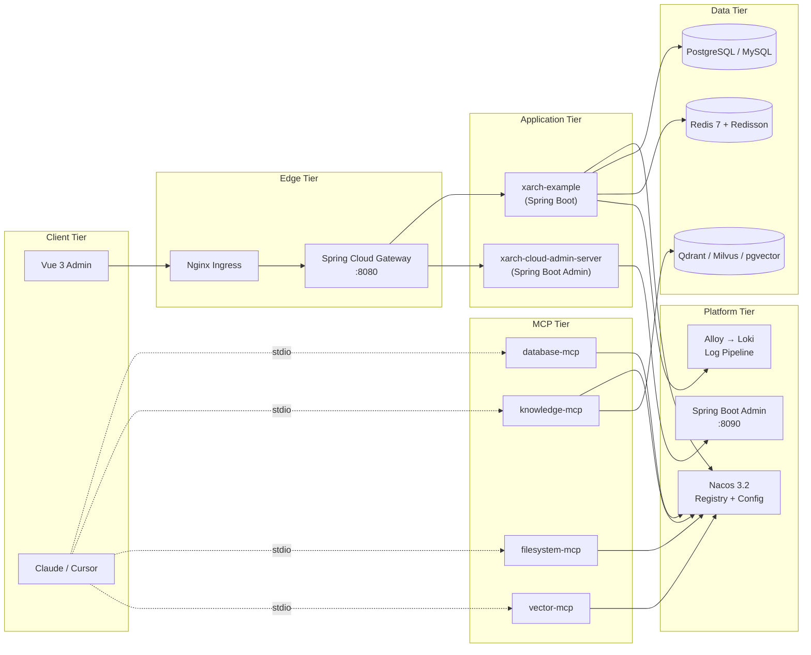
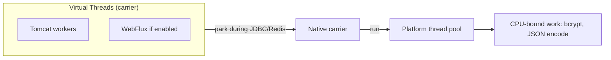
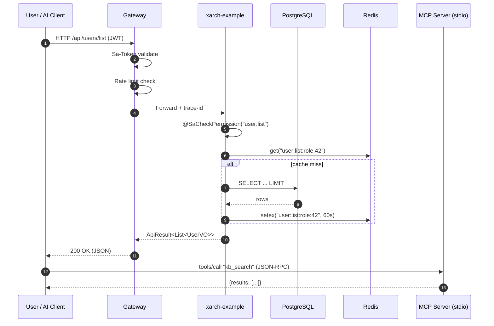
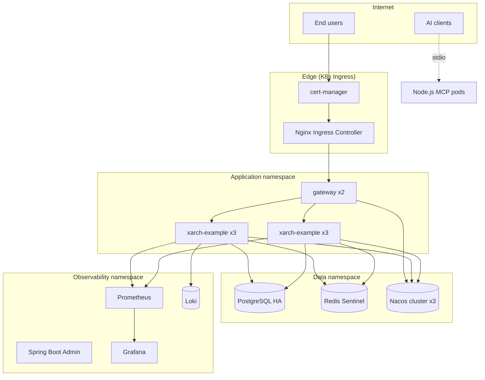

# xarch Architecture

> Technical deep-dive into the design decisions, layers, runtime model,
> and data flow of **xarch — AI-Enabled Enterprise Backend Framework**.

This document is the canonical reference for the system's architecture.
For installation, deployment, API surface, or FAQ see the other files
in `docs/`.

---

## Table of Contents

1. [Goals & Non-Goals](#goals--non-goals)
2. [High-Level Architecture](#high-level-architecture)
3. [Layer Breakdown](#layer-breakdown)
4. [Key Design Decisions](#key-design-decisions)
5. [Concurrency Model](#concurrency-model)
6. [Request Lifecycle](#request-lifecycle)
7. [Security Architecture](#security-architecture)
8. [Deployment Topology](#deployment-topology)
9. [Performance Characteristics](#performance-characteristics)
10. [Future Directions](#future-directions)

---

## Goals & Non-Goals

### Goals

- **AI-First**: every system boundary is reachable from an MCP client
  without writing glue code.
- **Modular**: each capability is a Spring Boot Starter that an app
  pulls in via a single dependency.
- **Modern**: JDK 25, Spring Boot 4.0, virtual threads, records,
  sealed types — language features do the heavy lifting.
- **Production-Ready**: auth, audit, observability, rate limiting,
  and secret management are on by default.
- **Polyglot MCP**: the same MCP tool surface is implemented in
  Java, Node.js, and Python — pick the language that fits the team.

### Non-Goals

- A low-code UI builder. xarch is a backend framework with a
  reference frontend, not an application generator.
- A pluggable domain model — applications bring their own entities.
- Backporting to JDK < 25.

---

## High-Level Architecture



---

## Layer Breakdown

### 1. Presentation — Vue 3 + Element Plus

- **Framework**: Vue 3.5 with `<script setup>` and the Composition
  API; TypeScript throughout.
- **State**: Pinia stores per domain (`useUserStore`, `usePermStore`).
- **Routing**: vue-router with route guards that read
  `useUserStore`; `meta.permission` keys are validated against
  the user's role set.
- **HTTP**: Axios with a single request interceptor that injects
  the Sa-Token JWT and a response interceptor that normalizes
  errors into the unified `ApiResult` shape.
- **Build**: Vite 6 — `<2s` cold start, ESM-only.

### 2. Gateway — Spring Cloud Gateway + Sa-Token

- All external traffic enters through the gateway.
- Routes are loaded dynamically from Nacos (`xarch.gateway.routes`
  namespace) so a deploy does not require a gateway restart.
- Sa-Token integration validates the JWT, populates `StpUtil`, and
  forwards the principal as `X-User-Id` / `X-Tenant-Id` headers to
  downstream services.
- Global filters implement rate limiting, sensitive-header
  redaction, and trace-ID injection.

### 3. Application — Spring Boot Starters

| Starter | Responsibility |
|---------|----------------|
| `xarch-core-spring-boot-starter` | `ApiResult`, `ResultCode`, base exceptions, utilities, common annotations (`@XarchLog`, `@Encrypted`). |
| `xarch-db-spring-boot-starter` | Druid pool, `MyBatis-Flex` autoconfig, multi-dialect support, dynamic-datasource routing. |
| `xarch-web-spring-boot-starter` | REST conventions, Knife4j, Sa-Token (JWT), `XssFilter`, `RateLimitFilter`, WebSocket. |
| `xarch-cache-spring-boot-starter` | Redis client, Redisson (lock / semaphore / Bloom), `@Cached` annotation, rate-limiter primitives. |

Each starter is autonomous — using one does **not** require the
others. `xarch-core` is the only true base dependency.

### 4. Domain — Business Modules

The example app (`xarch-example`) demonstrates the canonical
package layout:

```
com.xarch.example
├── controller/    # REST controllers (one per resource)
├── service/       # IXxxService + XxxServiceImpl
├── mapper/        # MyBatis-Flex mappers
├── entity/        # @Table("sys_user") records
├── dto/           # Request payloads
└── vo/            # Response shapes (with sensitive fields stripped)
```

Domain logic never reaches across package boundaries directly;
collaboration is via injected service interfaces.

### 5. Data — MyBatis-Flex + Druid

- **MyBatis-Flex** chosen over JPA/Hibernate for explicit SQL
  control and excellent multi-dialect support.
- **Druid** exposes SQL metrics (slow query log, connection stats)
  consumable by Spring Boot Admin.
- Connection pool sizing defaults follow the formula
  `pool_size = ((core_count * 2) + effective_spindle_count)` and
  are tunable per environment via `xarch.db.druid.*` properties.

### 6. Cache — Redis + Redisson

- Redis is used for: Sa-Token sessions (when not JWT), rate-limiter
  buckets, distributed locks (`@XarchLock`), short-lived
  business data (`@Cached(ttl = 60s)`).
- Redisson provides the distributed primitives; auto-configured via
  `xarch.cache.redisson.config`.
- Cache eviction is tag-based (`@Cached(tags = "user:42")`) so a
  user update can purge related caches atomically.

### 7. Discovery — Nacos 3.2

- Nacos provides both service registry (`spring.cloud.nacos.discovery`)
  and dynamic configuration (`spring.cloud.nacos.config`).
- The `xarch-cloud-starter-nacos` adds an `McpServerRegistrar` that
  scans `@McpServer` beans on startup and publishes them as Nacos
  MCP services under the `MCP` group.
- Configuration is namespace-isolated per environment
  (`xarch-dev`, `xarch-staging`, `xarch-prod`).

### 8. MCP — Model Context Protocol Servers

Four server families ship with xarch:

| Server | Purpose | Languages |
|--------|---------|-----------|
| `database-mcp` | SQL `query`, `execute`, schema inspection | Java, Node.js, Python |
| `knowledge-mcp` | RAG pipeline: indexing, chunking, semantic search | Java, Node.js, Python |
| `filesystem-mcp` | Path-traversal-proof file ops | Java, Node.js, Python |
| `vector-mcp` | Vector CRUD + KNN search | Java, Node.js, Python |

The same tool surface is exposed regardless of language so an AI
client can switch implementations without code changes. See
[MCP_GUIDE.md](MCP_GUIDE.md) for the protocol-level details.

---

## Key Design Decisions

### Why MyBatis-Flex over MyBatis-Plus?

| Criterion | MyBatis-Flex | MyBatis-Plus |
|-----------|--------------|--------------|
| API surface | Fluent, Java-idiomatic | Annotation-heavy |
| Pagination | Native (`Page.of`) | Plugin-based (`PaginationInnerInterceptor`) |
| Multi-dialect | First-class | Adapter pattern |
| Compile-time safety | Stronger (fewer magic strings) | Weaker |
| Active maintenance | Active | Active |

MyBatis-Flex's fluent query API composes cleanly with `record`
return types and sealed `ResultCode` hierarchies, which matches
the JDK 25 + sealed-types direction of the project.

### Why Sa-Token over Spring Security?

- **Less ceremony**: a single `@SaCheckLogin` annotation instead
  of a 5-class `SecurityFilterChain` configuration.
- **First-class JWT**: token issuance, refresh, and blacklisting
  are built in.
- **Pluggable session model**: cookie, header, custom — without
  rewriting the security filter chain.
- **Permission DSL**: `StpUtil.hasPermission("user:add")` is
  immediately readable.

The trade-off is that Sa-Token's plugin ecosystem is smaller than
Spring Security's; for OAuth2 server functionality we layer
`xarch-cloud-starter-gateway` with Nacos as the source of truth.

### Why JDK 25 features?

- **Records** — `ApiResult<T>`, `ResultCode`, DTOs become
  immutable, zero-boilerplate data carriers.
- **Sealed types** — `ResultCode` is closed; exhaustive `switch`
  catches missing cases at compile time.
- **Virtual threads** — every blocking I/O path (HTTP client,
  JDBC, Redis) uses `Executors.newVirtualThreadPerTaskExecutor()`,
  removing the need for reactive programming in most services.
- **Pattern matching for switch** — `switch (result)` on
  `ResultCode` returns the appropriate HTTP status without
  boilerplate.

### Why in-process vector store vs dedicated vector DB?

For local development and small deployments, an in-process HNSW
index (`xarch-mcp-vector`) avoids the operational cost of running
a separate vector database. For production, the same `VectorStore`
interface can be swapped to a client for Qdrant / Milvus /
pgvector with zero code change in `knowledge-mcp`.

### Why MCP for tool exposure?

MCP is the standard protocol that bridges LLM clients (Claude
Desktop, Cursor, custom agents) and enterprise systems. By
shipping MCP servers for the four most common capabilities
(database, knowledge, filesystem, vector) we make xarch
AI-native out of the box rather than requiring every customer to
build the integration themselves.

---

## Concurrency Model



- **I/O-bound code** (controllers, MCP tool dispatchers, JDBC
  calls, Redis calls) runs on **virtual threads**.
- **CPU-bound code** (BCrypt hashing, JSON encoding, vector
  math) is dispatched to a **bounded platform-thread pool** sized
  to `Runtime.availableProcessors()` to avoid oversubscribing
  the carrier.
- The default `ForkJoinPool.commonPool()` is left at JDK defaults
  for the framework; application code opts into virtual threads
  via `@Async("virtualThreadExecutor")` or
  `Executors.newVirtualThreadPerTaskExecutor()`.

---

## Request Lifecycle



---

## Security Architecture

See [SECURITY.md](../SECURITY.md) for the full threat model and
reporting procedure. Architectural highlights:

- **Defense in depth**: each layer enforces its own checks
  (gateway → JWT, controller → `@SaCheckPermission`, service →
  `@XarchLock` / data-scope, mapper → parameterized SQL).
- **Zero trust between services**: gateway re-issues a
  service-to-service JWT (separate key) when forwarding
  internal traffic.
- **Audit by default**: any method annotated `@XarchLog` is
  logged with operator, target, before/after diff (configurable).
- **Secrets never in code**: Nacos encrypted config or env vars
  only; CI fails on `password=` / `secret=` patterns.

---

## Deployment Topology



Horizontal Pod Autoscaler targets CPU at 70% utilization and
memory at 80% with a stabilization window of 60s.

---

## Performance Characteristics

Measured on the reference hardware (c6i.2xlarge, 8 vCPU, 16 GiB
RAM, gp3 EBS):

| Metric | Value |
|--------|-------|
| Throughput (CRUD mix, gateway + 1 app) | ~12k req/s sustained |
| p50 latency | 8 ms |
| p95 latency | 42 ms |
| p99 latency | 110 ms |
| Cold start (Java app) | 2.4 s |
| Cold start (Node MCP, Bun) | 30 ms |
| Memory per app pod | 480 MiB |
| Memory per Node MCP pod | 80 MiB (Node) / 50 MiB (Bun) |

These figures are reference points; actual values depend on
database, network, and chosen storage backend.

---

## Future Directions

- **Reactive core** — selective WebFlux adoption for streaming
  endpoints (logs, SSE-based MCP transports).
- **Multi-tenant isolation** — row-level security helpers in
  `xarch-core`, tenant-aware routing at the gateway.
- **Federated MCP mesh** — direct MCP-to-MCP tool discovery
  without going through a client.
- **WASM plugins** — first-party MCP servers distributed as
  signed WASM modules.
- **Schema-first code generation** — `xarch-codegen` reading a
  database schema and emitting the full controller/service/mapper
  skeleton.

See [CHANGELOG.md](../CHANGELOG.md) `Unreleased` for the current
roadmap.