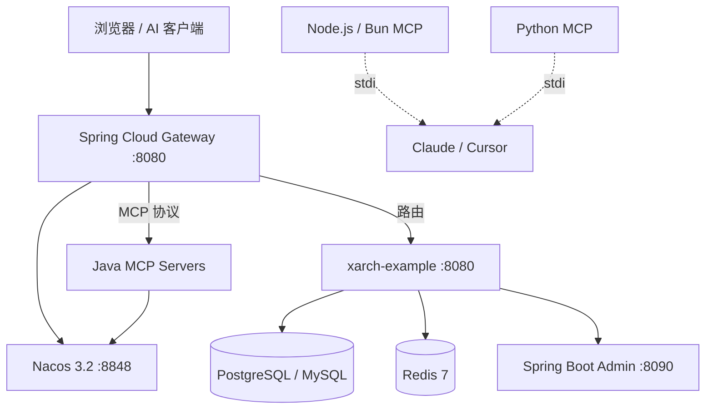

# xarch - AI 时代企业级后台管理框架

> xarch 是 AI 时代企业级后台管理项目规范，基于 Spring Boot 4.0 + Spring Cloud + Vue 3 + MyBatis-Flex 构建，为 AI 原生企业应用提供开箱即用的后台管理解决方案。

[English](../../README.md) | 简体中文

---

## 核心定位

xarch 不仅是一个框架，更是一套 **AI 时代企业后台管理的标准规范**：

- **AI-First Architecture** - 内置 AI 能力集成接口，原生支持 MCP（Model Context Protocol）
- **Enterprise-Grade** - 面向生产环境设计，提供完整的企业级功能：权限管理、操作审计、数据可视化
- **Spring Cloud Native** - 原生支持 Spring Cloud 微服务架构，Nacos 3.2 服务注册与发现
- **MCP Server 集成** - 内置 MCP 服务器，覆盖数据库、知识库、文件系统、向量四大 AI 核心能力
- **Modular Design** - 采用 Spring Boot Starter 架构，按需引入，灵活组合
- **Production-Ready** - 完整的监控、日志、测试体系，支持大规模生产环境

---

## 技术栈

### 后端

| 分类 | 技术 | 说明 |
|------|------|------|
| **Runtime** | Java 25 / Spring Boot 4.0 | 最新 LTS 版本 |
| **Build** | Gradle (Kotlin DSL) | 现代构建工具 |
| **ORM** | MyBatis-Flex | 简化 CRUD 操作 |
| **Database** | PostgreSQL 16 / MySQL 8.0 / MongoDB / SQL Server | 多数据库支持 |
| **Connection** | Druid | 监控型连接池 |
| **Cache** | Redis 7 + Redisson | 分布式缓存与锁 |
| **Auth** | Sa-Token (JWT) | 无状态认证 |
| **API Docs** | Knife4j (Swagger 3.0) | API 文档生成 |
| **Spring Cloud** | Spring Cloud 2025.0.0.0 | 微服务架构 |
| **Service Registry** | Nacos 3.2 | 服务发现与配置 |
| **API Gateway** | Spring Cloud Gateway | 统一入口 |

### 前端

| 分类 | 技术 | 说明 |
|------|------|------|
| **Framework** | Vue 3.5 + Vite 6 | 现代化前端框架 |
| **UI Library** | Element Plus | 企业级组件库 |
| **State** | Pinia | 状态管理 |
| **Language** | TypeScript | 类型安全 |
| **HTTP** | Axios | HTTP 请求 |

---

## 项目结构

```
xarch/
├── backend/                              # Spring Boot 后端 (Gradle)
│   ├── xarch-spring-boot-starter/        # Spring Boot Starter 模块
│   │   ├── xarch-core-spring-boot-starter/    # 核心模块
│   │   ├── xarch-db-spring-boot-starter/      # 数据库模块
│   │   ├── xarch-web-spring-boot-starter/     # Web 模块
│   │   ├── xarch-cache-spring-boot-starter/   # 缓存模块
│   │   └── xarch-mcp/                          # MCP Servers (Java)
│   │       ├── xarch-mcp-database/             # 数据库 MCP
│   │       ├── xarch-mcp-knowledge/            # 知识库 MCP (RAG)
│   │       ├── xarch-mcp-filesystem/           # 文件系统 MCP
│   │       └── xarch-mcp-vector/               # 向量数据库 MCP
│   ├── xarch-spring-cloud/               # Spring Cloud 模块
│   │   ├── xarch-cloud-starter-nacos/    # Nacos 服务注册
│   │   ├── xarch-cloud-starter-gateway/  # API 网关
│   │   └── xarch-cloud-starter-mcp/      # MCP 协议核心
│   └── xarch-example/                    # 示例应用
│
├── node-mcp-servers/                     # Node.js MCP Servers (TypeScript)
│   ├── database-mcp/                     # 数据库 MCP
│   ├── knowledge-mcp/                   # 知识库 MCP (RAG)
│   ├── filesystem-mcp/                   # 文件系统 MCP
│   └── vector-mcp/                       # 向量数据库 MCP
│
├── py-mcp-servers/                       # Python MCP Servers
│   ├── database_mcp/                     # 数据库 MCP
│   ├── knowledge_mcp/                    # 知识库 MCP
│   ├── filesystem_mcp/                   # 文件系统 MCP
│   └── python/vector_mcp/                # 向量数据库 MCP
│
├── vue3-admin/                           # Vue 3 前端
├── k8s/                                  # Kubernetes 部署配置
├── docker-compose.yml                    # Docker 编排
└── docs/                                 # 文档
    ├── ARCHITECTURE.md
    ├── MCP_GUIDE.md
    ├── DEPLOYMENT.md
    ├── FAQ.md
    ├── API_REFERENCE.md
    ├── i18n/                             # 国际化翻译
    └── db/                               # 数据库初始化脚本
```

---

## 核心功能

### 1. MCP Server — AI 能力核心

MCP（Model Context Protocol）是 AI 与企业系统连接的桥梁。

| MCP Server | 端口 | 功能 |
|------------|------|------|
| Database MCP | 9090 | SQL 查询、架构管理、多数据库支持 |
| Knowledge MCP | 9091 | RAG 知识库、文档索引、语义搜索 |
| Filesystem MCP | 9092 | 安全文件操作、路径遍历防护 |
| Vector MCP | 9093 | 向量数据库、RAG 语义搜索 |

**三种语言实现：**

- **Java 实现**（Spring Boot）— 与 Spring Cloud 微服务体系无缝集成
- **Node.js 实现**（TypeScript）— **支持 Bun 运行时**，更快启动、更低内存
- **Python 实现** — 兼容 Python 数据科学生态

**支持的向量数据库：**

| 数据库 | 说明 |
|--------|------|
| Qdrant | 高性能向量数据库 |
| Milvus | 开源向量数据库，大规模检索 |
| Chroma | 轻量级向量数据库 |
| Weaviate | 云原生向量数据库 |
| Pinecone | 托管向量数据库 |
| PGvector | PostgreSQL 向量扩展 |
| OpenSearch | KNN 向量搜索 |
| Elasticsearch | 密集向量搜索 |
| FAISS | Facebook AI 向量库 |

详细使用参见 [MCP_GUIDE.md](../MCP_GUIDE.md)。

### 2. 企业级文件管理中心

支持多种存储后端：

| 存储类型 | 说明 |
|---------|------|
| `local` | 本地文件系统 |
| `minio` | MinIO 对象存储 |
| `aliyun_oss` | 阿里云 OSS |

### 3. 系统管理模块

| 模块 | 功能 |
|------|------|
| 用户管理 | CRUD、角色分配、数据范围 |
| 角色管理 | 权限分配、菜单授权、数据范围 |
| 菜单管理 | 树形结构、权限标识 |
| 部门管理 | 组织架构树 |
| 岗位管理 | 职位设置 |
| 通知公告 | 信息发布 |

### 4. 监控与日志

| 组件 | 说明 | 端口 |
|------|------|------|
| Spring Boot Admin | 服务监控 | 8090 |
| Grafana | 可视化面板 | 3001 |
| Loki | 日志聚合 | 3100 |
| Prometheus | Metrics 收集 | 9090 |
| Alloy | 日志收集 | 12345 |

---

## 为什么选择 xarch？

| 特性 | xarch | 传统方案 |
|------|-------|---------|
| AI 能力集成 | 内置 MCP Server，开箱即用 | 需自行集成 |
| Spring Cloud | 原生 Nacos 3.2 服务注册 | 无原生支持 |
| MCP 协议 | 数据库/知识库/文件系统/向量 | 不支持 |
| 多语言实现 | Java + Node.js + Python | 单一实现 |
| 开发效率 | Starter 按需引入，5 分钟启动 | 搭建繁琐 |
| 测试覆盖 | 全量单元 + 集成测试 | 缺乏测试 |
| 现代化技术栈 | Java 25 / Spring Boot 4.0 / Vue 3.5 | 版本较老 |

---

## 快速开始

### 前置条件

| 工具 | 版本 |
|------|------|
| JDK | 25 |
| Node.js | 20+ |
| Docker | 24+ |
| Python（可选） | 3.10+ |

### 后端启动

```bash
cd backend
./gradlew build -x test
cd xarch-example
./gradlew bootRun

# API 文档：http://localhost:8080/doc.html
```

### 前端启动

```bash
cd vue3-admin
pnpm install
pnpm dev

# 访问地址：http://localhost:3000
```

### MCP Server 启动（Node.js / Bun）

```bash
# 任选一个 MCP Server 目录
cd node-mcp-servers/database-mcp

npm install && npm run build
npm start                  # Node.js 启动
npm run start:bun          # Bun 启动（更快）
```

### 在 Claude Desktop 中使用 Bun 启动

```json
{
  "mcpServers": {
    "xarch-database": {
      "command": "bun",
      "args": ["run", "node-mcp-servers/database-mcp/dist/index.js"]
    },
    "xarch-knowledge": {
      "command": "bun",
      "args": ["run", "node-mcp-servers/knowledge-mcp/dist/index.js"]
    },
    "xarch-filesystem": {
      "command": "bun",
      "args": ["run", "node-mcp-servers/filesystem-mcp/dist/index.js"]
    },
    "xarch-vector": {
      "command": "bun",
      "args": ["run", "node-mcp-servers/vector-mcp/dist/index.js"]
    }
  }
}
```

### Docker 部署

```bash
docker-compose up -d

# 访问点：
# - 前端：http://localhost
# - 后端 API：http://localhost/api
# - API 文档：http://localhost:8080/doc.html
```

---

## 功能模块（17 个控制器）

### 系统管理

| 控制器 | 端点 | 功能说明 |
|--------|------|---------|
| `UserController` | `/system/user/*` | 用户管理 |
| `RoleController` | `/system/role/*` | 角色管理 |
| `MenuController` | `/system/menu/*` | 菜单管理 |
| `DeptController` | `/system/dept/*` | 部门管理 |
| `PostController` | `/system/post/*` | 岗位管理 |
| `NoticeController` | `/system/notice/*` | 通知公告 |

### 系统配置

| 控制器 | 端点 | 功能说明 |
|--------|------|---------|
| `DictController` | `/system/dict/*` | 字典管理 |
| `ConfigController` | `/system/config/*` | 参数配置 |

### 日志管理

| 控制器 | 端点 | 功能说明 |
|--------|------|---------|
| `LoginLogController` | `/monitor/logininfor/*` | 登录日志 |
| `OpLogController` | `/monitor/operlog/*` | 操作日志 |

### 监控管理

| 控制器 | 端点 | 功能说明 |
|--------|------|---------|
| `SysServerController` | `/monitor/server/*` | 服务器监控 |
| `SysCacheController` | `/monitor/cache/*` | 缓存监控 |
| `SysUserOnlineController` | `/monitor/online/*` | 在线用户 |
| `SysJobController` | `/monitor/job/*` | 定时任务 |
| `SysJobLogController` | `/monitor/jobLog/*` | 任务日志 |

### 业务模块

| 控制器 | 端点 | 功能说明 |
|--------|------|---------|
| `CaptchaController` | `/captcha/*` | 验证码 |
| `ClientController` | `/client/*` | OAuth 客户端 |
| `MessageController` | `/message/*` | 消息中心 |
| `ResourceController` | `/resource/*` | 资源管理 |
| `TempFileController` | `/tempFile/*` | 临时文件 |
| `CommonController` | `/common/*` | 通用操作 |
| `ServerManageController` | `/ai/server/*` | Linux 服务器管理 + AI Agent |

### Excel 模块

| 控制器 | 端点 | 功能说明 |
|--------|------|---------|
| `ExcelController` | `/excel/*` | Excel 导入导出 |

### 文件管理

| 控制器 | 端点 | 功能说明 |
|--------|------|---------|
| `FileController` | `/file/*` | 企业级文件管理 |

### MCP HTTP 网关

| 控制器 | 端点 | 功能说明 |
|--------|------|---------|
| `DatabaseMcpController` | `/mcp/database/*` | 数据库 MCP |
| `KnowledgeMcpController` | `/mcp/knowledge/*` | 知识库 MCP |
| `FilesystemMcpController` | `/mcp/filesystem/*` | 文件系统 MCP |
| `VectorMcpController` | `/mcp/vector/*` | 向量数据库 MCP |

完整接口文档请参见 [API_REFERENCE.md](../API_REFERENCE.md)。

---

## 系统架构



---

## API 响应格式

统一响应结构 `ApiResult<T>`：

```json
{
  "code": "0000",
  "msg": "success",
  "data": { },
  "timestamp": 1716038400000
}
```

**响应码规范：**

| 响应码 | 说明 |
|--------|------|
| `0000` | 成功 |
| `1001` | 参数错误 |
| `1002` | 业务异常 |
| `1003` | 认证失败 |
| `1004` | 资源未找到 |
| `1005` | 系统错误 |

---

## 开发规范

### 包命名

```
com.xarch.starter.*   # 框架 Starter 模块
com.xarch.cloud.*     # Spring Cloud 模块
com.xarch.mcp.*       # MCP Server 模块
com.xarch.example.*   # 业务应用模块
```

### 分层架构

```
controller/   # REST 控制器层
service/      # 业务服务层（接口 + 实现）
mapper/       # 数据访问层（MyBatis-Flex）
entity/       # 领域实体层
dto/          # 数据传输对象
vo/           # 视图对象
```

### 命名约定

| 类型 | 命名规则 | 示例 |
|------|---------|------|
| Controller | `XxxController` | `UserController` |
| Service 接口 | `IXxxService` | `IUserService` |
| Service 实现 | `XxxServiceImpl` | `UserServiceImpl` |
| Mapper | `XxxMapper` | `UserMapper` |
| Entity | `Xxx` | `User` |
| REST API | `/xxx` | `/user`, `/role` |

完整规范请参见 [CONTRIBUTING.md](../../CONTRIBUTING.md)。

---

## 部署

支持三种部署形态：

| 环境 | 工具 | 适用场景 |
|------|------|---------|
| 本地开发 | Docker Compose | 快速启动，集成调试 |
| 预发布 | K8s（dev overlay） | 单节点或小集群 |
| 生产 | K8s（prod overlay） + HPA | 多节点，自动扩缩容 |

详细步骤请参见 [DEPLOYMENT.md](../DEPLOYMENT.md)。

---

## 贡献指南

欢迎通过 Issue、Pull Request、Discussion 参与项目。请阅读：

- [CONTRIBUTING.md](../../CONTRIBUTING.md) — 贡献流程与开发规范
- [CODE_OF_CONDUCT.md](../../CODE_OF_CONDUCT.md) — 社区行为准则
- [SECURITY.md](../../SECURITY.md) — 漏洞报告方式

代码规范摘要：

- Java：Google Java Style + Lombok；record 类型优先；构造器注入
- TypeScript：ESLint + Prettier 3.x；strict 模式
- Python：ruff + mypy --strict
- 提交信息：Conventional Commits（`feat:` / `fix:` / `docs:` 等）

---

## 文档导航

| 文档 | 说明 |
|------|------|
| [ARCHITECTURE.md](../ARCHITECTURE.md) | 架构设计 |
| [MCP_GUIDE.md](../MCP_GUIDE.md) | MCP 服务器使用指南 |
| [DEPLOYMENT.md](../DEPLOYMENT.md) | 部署手册 |
| [FAQ.md](../FAQ.md) | 常见问题 |
| [API_REFERENCE.md](../API_REFERENCE.md) | 接口参考 |
| [CHANGELOG.md](../../CHANGELOG.md) | 更新日志 |
| [CONTRIBUTING.md](../../CONTRIBUTING.md) | 贡献指南 |
| [SECURITY.md](../../SECURITY.md) | 安全政策 |
| [CODE_OF_CONDUCT.md](../../CODE_OF_CONDUCT.md) | 行为准则 |

---

## License

MIT License - 自由使用，商用免费

---

**xarch — 让企业后台开发更简单，让 AI 集成更容易，让微服务治理更轻松。**